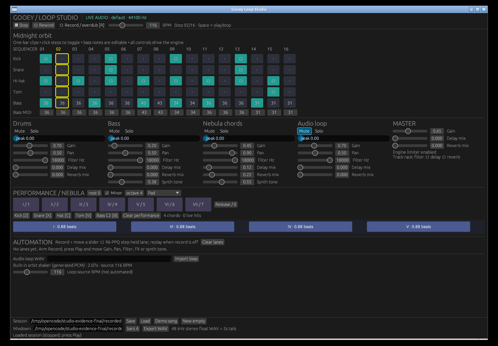
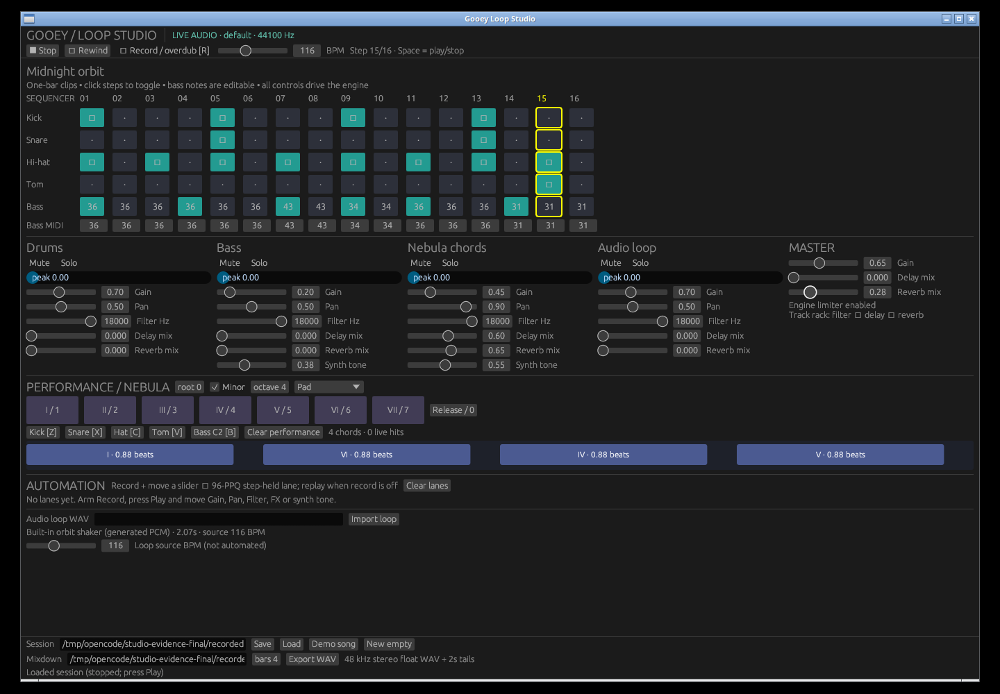
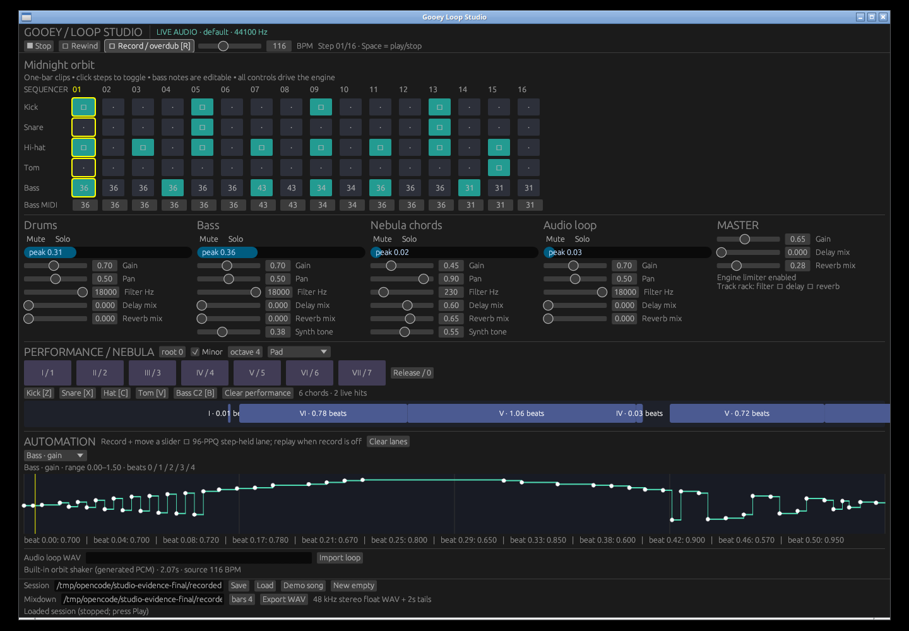
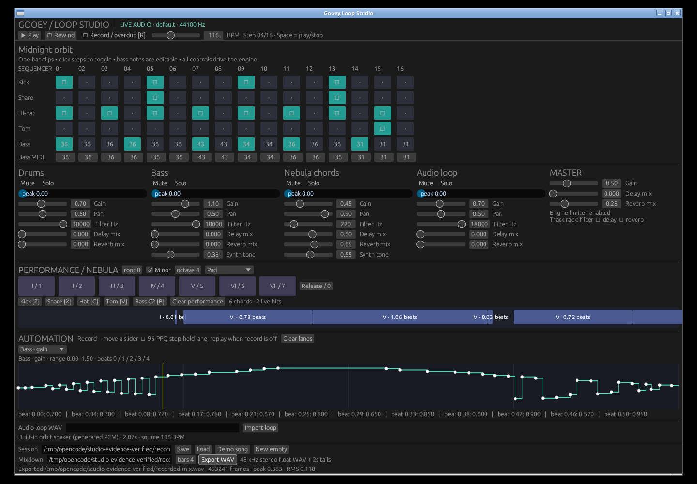

# Independent Loop Studio verification

## Actual GUI interaction recording

[Watch the 70-second screen recording with live engine audio](assets/loop-studio/interactions.mp4).
This is the real Rust eframe window operated with X11 mouse/keyboard events,
not a mockup or prerecorded audio substituted for the engine output.
Audio was routed through an existing PipeWire/PulseAudio-compatible virtual
stereo sink on the Linux server, not auditioned through physical speakers.
The GUI used CPAL at 44.1 kHz; offline mixdown used 48 kHz.

Approximate recording stages:

- 0–6 s: populated demo and simultaneous four-track playback.
- 6–13 s: bass gain, chord pan, audio-track mute, and bass solo.
- 13–21 s: independent chord delay/reverb and master reverb.
- 21–36 s: arm overdub, hold chord pads, play drum/bass hits, record bass gain,
  chord filter, and master gain movements.
- 36–43 s: disarm and replay the recorded automation with the visible lane cursor.
- 43–60 s: stop, save the session, and export final mixdown.
- 60–70 s: load the saved session, rewind, and replay its recorded performance.

### Mixing



### Track and master effects



### Recorded automation playback



### Final mixdown



The saved song has six nonoverlapping chord gates, two live hits, and three
automation lanes: bass gain (53 points), chord filter (50 points), and master
gain (18 points). Repeating the interaction naturally changes recorded tick
positions and point counts.

The GUI's export was byte-identical to a fresh headless export of the saved
JSON. An independent Python RIFF/WAV reader verified stereo float32, 48 kHz,
493241 frames (10.275854 seconds including two seconds of tails), finite
nonzero audio, peak 0.383164, and channel RMS 0.107158/0.128176.

## Tests and build checks

The final release suite passed **927 tests**, with four ignored tests including
documentation examples. This includes 24 new studio integration tests and a
1001-bar fractional-step timing regression. Both native CPAL and device-free
GUI release builds pass. Linux `cargo check --no-default-features --features ios`
also passes; this is feature compatibility, not an Apple-target build.
Formatting, diff whitespace checks, and Python syntax checks pass. Clippy
completes successfully with existing library warnings, but no diagnostics in
the new studio module, examples, or tests. Repository-wide `-D warnings` is not
clean; unrelated DSP/API warnings were not suppressed or rewritten.

Extended final-build render and live-soak verification are being completed;
their measured results will be added before submission.

## Reproduction

Install Rust plus ALSA/X11/Wayland/OpenGL development libraries for the native
Linux build. For capture also install Xvfb, Openbox, ffmpeg, ImageMagick,
xdotool, and the PulseAudio command-line utilities. The existing audio server
must provide a monitor source; adapt the name if it is not `gooey_studio.monitor`.

```sh
cargo build --release --features studio-gui --example loop_studio --example studio_render
Xvfb :99 -screen 0 1440x1000x24 -nolisten tcp
# In separate terminals:
DISPLAY=:99 openbox
pactl load-module module-null-sink sink_name=gooey_studio rate=48000 channels=2
pactl set-default-sink gooey_studio
DISPLAY=:99 LIBGL_ALWAYS_SOFTWARE=1 target/release/examples/loop_studio --demo
python3 scripts/capture_loop_studio.py --output /tmp/opencode/studio-evidence-new
python3 scripts/verify_studio_wav.py /tmp/opencode/studio-evidence-new/recorded-mix.wav
target/release/examples/studio_render --load /tmp/opencode/studio-evidence-new/recorded-session.json \
  --bars 4 --export /tmp/opencode/studio-evidence-new/headless-replay.wav
cmp /tmp/opencode/studio-evidence-new/recorded-mix.wav /tmp/opencode/studio-evidence-new/headless-replay.wav
cargo test --release --no-default-features --features studio
```

Capture expects the initial demo layout and exactly one studio window. It uses
fixed coordinates and a fresh output directory. It validates that the song
contains recorded chords/hits/lanes and that mixdown exists. UI screenshots and
saved data are also inspected independently; this is not a comprehensive
cross-platform GUI-test framework. The video and selected screenshots are
committed here; large generated WAV/JSON and extended recordings stay under
`/tmp/opencode/` rather than adding megabytes of duplicate audio/sample data.

## Problems caught by independent review

The first real GUI capture found a bug not covered by the initial 15 tests:
held overdubs crossing existing demo chord starts produced overlapping gates,
so Save and Export failed. Last-take-wins canonical gates now preserve the
newest finalized gesture, retain uncovered older fragments, handle loop seams,
and install the same clip into live replay. Regression tests cover export,
reload, same-tick and wrapping overdubs. The final recording above demonstrates
the repaired path, not the failed first attempt.

Further review caught stop/resume clock divergence, long-run legacy sequencer
rounding, malformed WAV header arithmetic, low-rate duration bounds, and
unnecessary time-stretch correlation at equal tempos. Fixes and explicit
transport semantics are documented in [the usage/API guide](loop-studio.md).

## Scope and production tradeoffs

This deliberately exposes four fixed tracks, one-bar performance/automation,
and fixed filter/delay/reverb track racks. It is not an arrangement editor,
arbitrary-instance instrument host, plugin host, microphone recorder, MIDI-input
host, or undo-enabled DAW. Stop→Play and active tempo edits restart at bar zero
instead of pretending to provide sample-correct pause/resume. Tempo is not
recorded as automation. Session JSON embeds float samples and can be large.

The GUI shares a mutex with the audio callback. File preparation/export happen
on workers, but drawing, copying snapshots and some control updates can still
delay rendering. Passing tests and a live soak are not a hard-real-time guarantee.
Production work should use render-owned command queues and immutable prepared
session snapshots, generalize track/instrument instances and clip lengths, and
add a native pause/seek contract before introducing an arrangement timeline.
