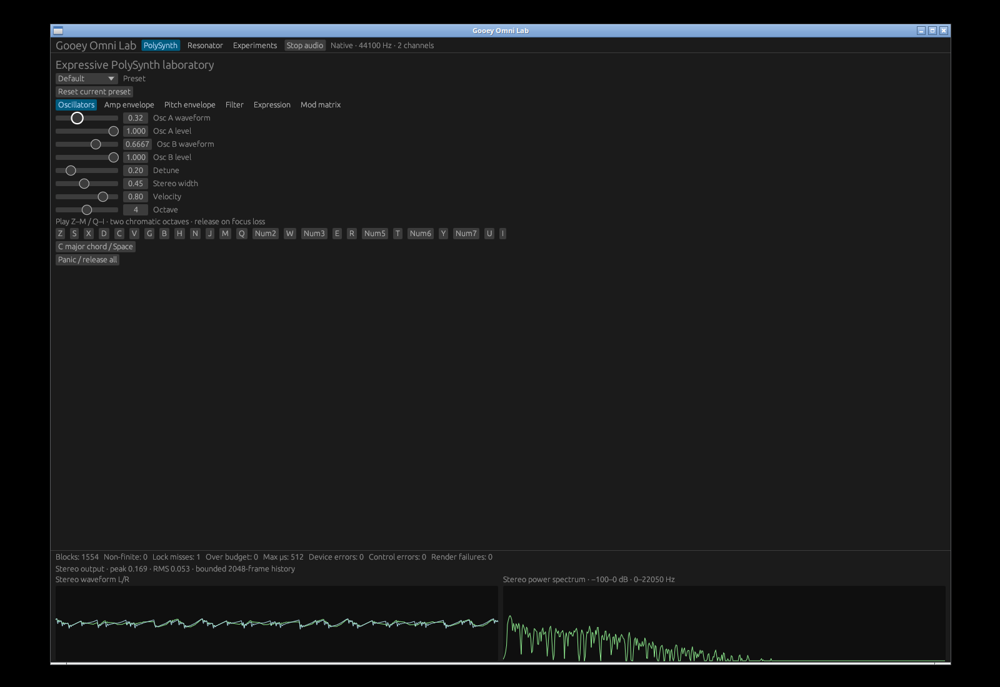
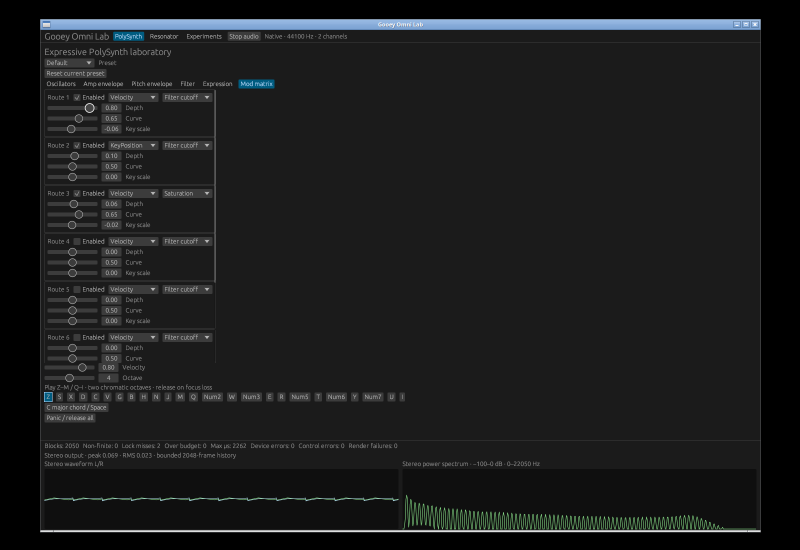
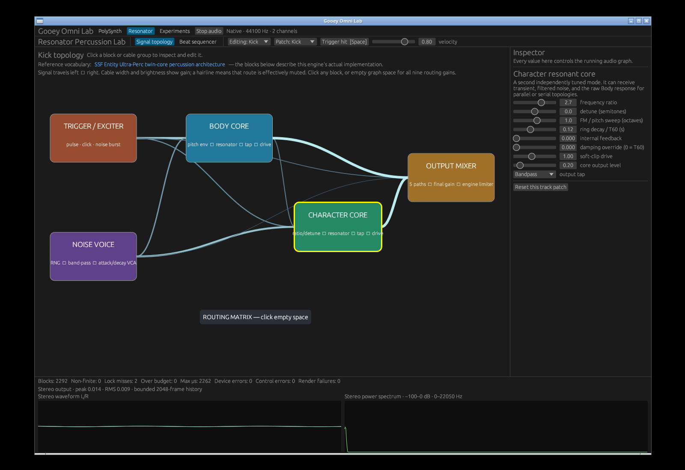
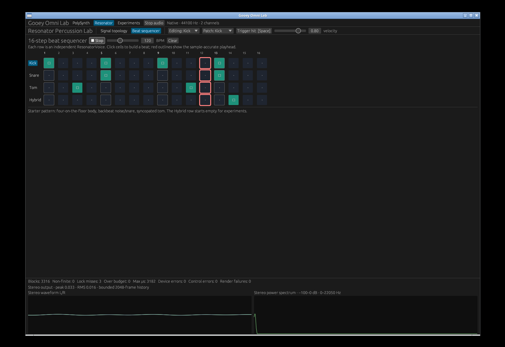
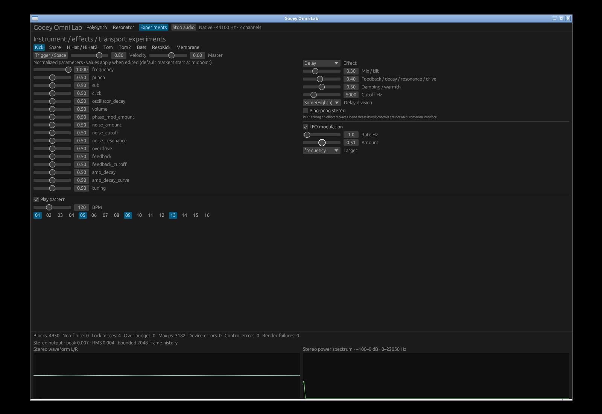

# Independent Omni Lab verification

[Actual screen/audio interaction recording](assets/omni-gui/interactions.mp4)

The native eframe app was operated through real X11 mouse/key events at
1600×1100. CPAL rendered stereo at 44.1 kHz into the server's PipeWire-compatible
virtual sink; the recording captures that live audio, not substituted mixdown.
No physical-speaker audition or Apple-target run is claimed.

## Interactions

The recording plays a held PolySynth chord, changes an oscillator and modulation
depth, switches panels while a synth key is held, inspects the resonator graph
and routing, edits a Hybrid beat and plays its four-track sequence, then switches
to instrument/FX experiments. It edits kick frequency, selects Delay, enables
LFO modulation and adjusts depth. Finally it cycles all panels eight times
while output is active, then stops/resumes the shared audio host.

After each panel switch the capture script queries actual sink inputs and
asserts there is exactly **one** Omni audio stream. This does not prove every
possible race, but independently verifies real stream lifecycle alongside the
unit/harness tests. Keyboard releases, scope activity, actual selected controls,
and health counters were reviewed in the screenshots/video.











FFmpeg independently analyzed the capture audio: no NaN/Inf samples, peak
−11.36 dBFS and RMS −30.97 dBFS. Silence between auditions and during panel
switches is expected. In the experiment screenshot, the host has zero
nonfinite samples, device errors, control errors and render failures. Four
observed lock misses are visible rather than hidden. Passing a capture does
not imply that the POC is hard real-time or that underruns cannot occur.

## Verification commands

The independent release library/integration suites passed **886 tests each**
with and without native audio:

```sh
cargo test --release --no-default-features --features gui --lib --tests
cargo test --release --features gui --lib --tests
cargo build --release --features gui --example omni_gui
```

The implementation pass additionally tested native and device-free suites,
headless layouts, input state, panel deactivation, parameter/route descriptors,
effect/instrument changes and bounded telemetry. The parent independently
repeated the **3600-second synthesized dynamic stress**: 600 seconds for each
of three panels at 44.1 and 48 kHz, 103359 and 112500 blocks per panel
respectively. All six runs passed. The parent also repeated the **180-second
wall-clock silent worker/control soak**, 180 panel auditions and 28014 blocks,
with no nonfinite audio or renderer failures. Linux `ios` feature compatibility
also passed independently. Final logs are server-local at
`/tmp/opencode/omni-independent-{tests,native-tests,stress,soak}.log`.

Capture reproduction (install Xvfb, Openbox, ffmpeg, xdotool, ImageMagick and
PulseAudio CLI utilities; create the monitor sink on the existing audio server):

```sh
Xvfb :99 -screen 0 1600x1100x24 -nolisten tcp
# Separate terminals:
DISPLAY=:99 openbox
pactl load-module module-null-sink sink_name=gooey_omni rate=48000 channels=2
DISPLAY=:99 LIBGL_ALWAYS_SOFTWARE=1 target/release/examples/omni_gui
python3 scripts/capture_omni_gui.py --output /tmp/opencode/omni-evidence-new
```

The coordinate-based capture expects default editor state and exactly one
native app window. It moves only the Omni stream to the virtual sink, rather
than changing the user's default audio device. Its timeline, codec log and
full screenshots stay under the chosen server-local output path. Selected
screenshots and the complete interaction video are committed here.

## Compatibility and remaining limitations

See [migration/API guide](omni-gui.md) for the full mapping of previous GUI
paths. `visualization` now enters the central app; non-graphical CLI paths
remain available. Explicit `legacy-visualization` preserves the old exported
GLFW window implementation for external callers, not a second example UI.
Its build currently needs CMake on this server; optional plotting also needs
Fontconfig development metadata. Those optional toolchain failures are not
counted as passed compatibility checks.

Built-in legacy Engine synthesis still allocates in some paths. Control updates
may contend with render locks; the shared host produces silence on missed
try-locks and reports those misses. Effect replacement clears tails, and
experimental normalized markers start at midpoint rather than reading every
instrument's preset value. Centralization makes these concerns inspectable
and provides one extension contract, but does not claim to solve every DSP or
real-time ownership problem. Loop Studio is a subsequent dependent panel,
not bundled into this standalone prerequisite.
