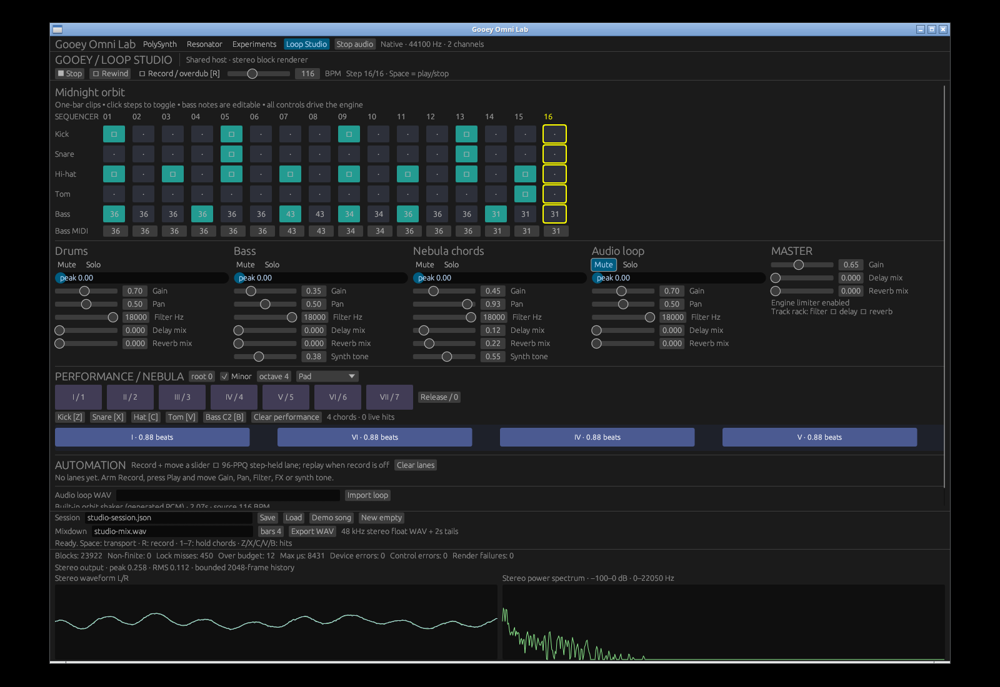
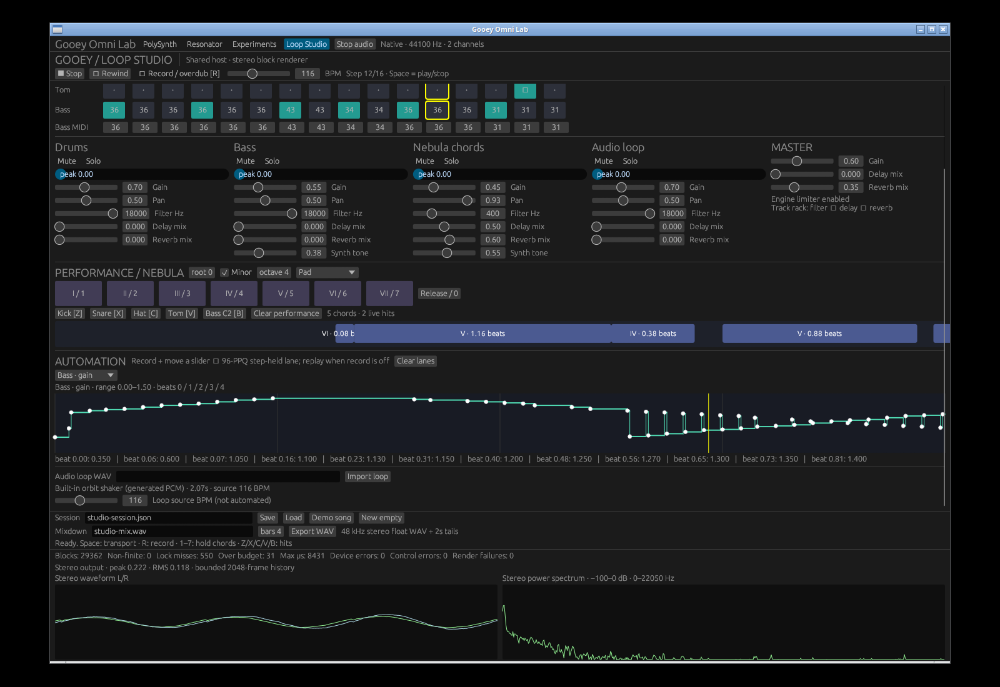
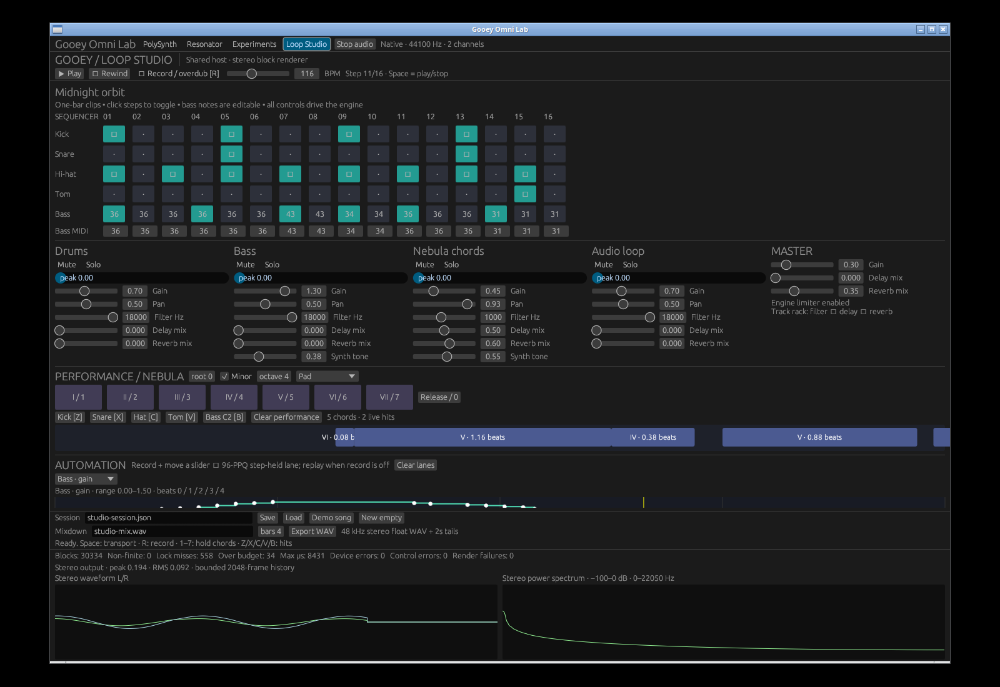
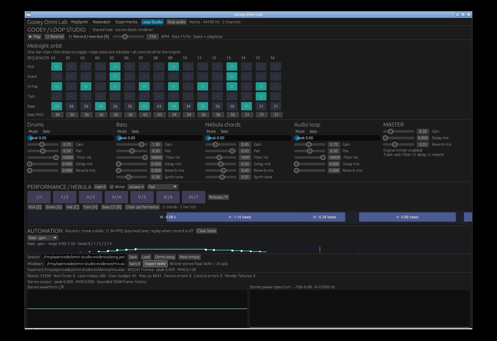

# Loop Studio in the central GUI: independent verification

[Actual central-app screen/audio recording](assets/omni-studio/interactions.mp4)

This new 69-second recording shows **Loop Studio mounted inside Gooey Omni
Lab**, sharing its tabs, native audio owner, scope/spectrum and health counters.
It is not the historical standalone studio capture. The old evidence remains
labeled historical in [the original verification notes](loop-studio-verification.md).

## Complete workflow

The native app plays all four demo tracks, changes gain/pan/mute/solo, edits
track/master effects, records chord/hit gestures and three automation lanes,
and replays their visible cursor. It then switches to PolySynth **while a chord
is held and recording is active**, releases the key and returns to Studio.
The song survives; recording and transport are stopped and the held gesture
is released. The final song saves, exports, reloads and plays again.

After each switch the capture script queries real sink inputs and asserts
exactly one Omni output stream. The exported session contains five canonical
chord gates, two hits, bass-gain automation (57 points), chord-filter automation
(51 points) and master gain (15 points). Counts/ticks vary naturally on repeat.









The GUI-exported WAV and a fresh headless export of the saved JSON are
**byte-identical**: stereo float32, 48 kHz, 493241 frames (10.275854 seconds with
two seconds of tails), finite nonzero audio, peak 0.4294, RMS 0.1380. An
independent Python RIFF reader validates the output, separate from Rust/hound.
FFmpeg's analysis of the actual live capture found no NaN/Inf samples, peak
−4.14 dBFS and RMS −19.38 dBFS. Live audio uses a virtual-device monitor at
44.1 kHz rather than physical-speaker audition; recording encodes at 48 kHz.

## What diagnostics exposed

The shared host intentionally uses render try-locks rather than blocking on
GUI drawing. Under this capture/load, the final mixdown screenshot reports
680 lock misses and 41 over-budget blocks, but zero nonfinite samples, device
errors, control errors or render failures. These counters are cumulative.
Missed locks render silence and Studio's musical clock advances only for
actually rendered frames. This **is not a glitch-free audio claim**: shared
diagnostics now make the contention visible across labs. Production control
queues/immutable snapshots remain needed; see [API findings](loop-studio-api-findings.md).

## Independent build/test verification

The release native/no-native combined suites pass **947 library/integration tests each**,
including all 24 studio tests and five additional GUI integration regressions
for mount/deactivate/song preservation, worker replacement, keyboard focus,
layout and recording/export. Native combined app, thin compatibility entrypoint
and headless CLI release builds pass. The device/window-independent `studio`
CLI also checks without GUI/native features. Independent wall-clock shared
worker/control soak passes **120 seconds, 120 panel auditions, 18216 blocks**,
with no nonfinite audio or renderer failures.

```sh
cargo test --release --no-default-features --features studio-gui --lib --tests
cargo test --release --features studio-gui --lib --tests
cargo build --release --features studio-gui --example omni_gui --example loop_studio --example studio_render
target/release/examples/omni_gui --demo --stress 300
target/release/examples/omni_gui --demo --soak 120
```

Independent dynamic stress passes **2400 synthesized seconds**: each of four
panels renders 300 seconds at both 44.1 and 48 kHz, while exercise callbacks
change musical/control state. All eight runs pass (51679 blocks per 44.1 kHz
panel and 56250 per 48 kHz panel). The standalone prerequisite additionally
has independent native/no-native 886-test suites, 3600 synthesized stress
seconds and a 180-second worker/control soak. Clippy completes with existing
library warnings and no diagnostics in GUI/studio/example/test paths. Formatting,
whitespace and Python syntax checks pass. Both captured native apps close
cleanly through their window-manager controls.

## Reproduce the actual central UI recording

Use the X11/PipeWire setup from [Omni Lab verification](omni-gui-verification.md)
and launch exactly one initial demo window on the 1600×1100 display:

```sh
DISPLAY=:99 LIBGL_ALWAYS_SOFTWARE=1 target/release/examples/omni_gui --panel 'Loop Studio' --demo
python3 scripts/capture_omni_studio.py --output /tmp/opencode/omni-studio-evidence-new
python3 scripts/verify_studio_wav.py /tmp/opencode/omni-studio-evidence-new/mix.wav
target/release/examples/studio_render --load /tmp/opencode/omni-studio-evidence-new/song.json \
  --bars 4 --export /tmp/opencode/omni-studio-evidence-new/headless.wav
cmp /tmp/opencode/omni-studio-evidence-new/mix.wav /tmp/opencode/omni-studio-evidence-new/headless.wav
```

The coordinate-based capture expects default editor state. It records actual
mouse/key interactions, scrolls the editor to show automation, and validates
the persisted song and mixdown. It is not a portable GUI test framework.
Selected screenshots/video are committed; generated JSON/WAV and full logs
remain server-local under `/tmp/opencode/omni-studio-evidence/`.

## Dependency and ownership

This branch is stacked on `omni-gui-test-app`, the standalone prerequisite.
Review/merge that first. `studio-gui = ["studio", "gui"]`; the new editor lives
in `src/gui/studio.rs`, implements `GuiPanel`, and returns `InterleavedAdapter`
for its safe `Studio` renderer. `src/gui/mod.rs` remains the sole eframe App
and `src/gui/audio.rs` the sole GUI native/silent owner. The compatibility
`loop_studio` example only selects the central panel. No second application,
CPAL callback or silent worker is hidden inside Studio.
